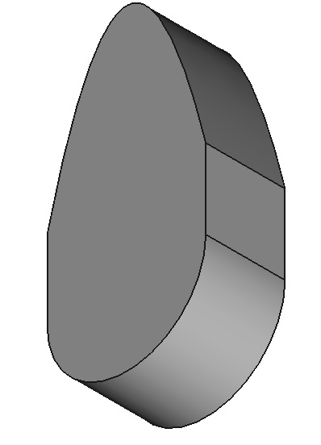
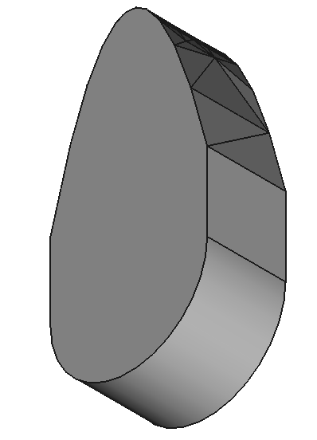

A Python package for automatically replacing spline edges / faces in CAD geometry.

Spines can not be directly converted to Constructive Solid Geometry (CSG).

Once splines have been removed then CAD to CSG conversion software such as [McCad](https://github.com/inr-kit/McCad-Salome-Binaries) and [Geouned](https://github.com/GEOUNED-org/GEOUNED) can then be used to convert the spline free geometry to CSG.

This technique is based on [CadQuery forum post staring in 2022 and getting solved in 2024](https://groups.google.com/g/cadquery/c/Ia84dtcnCo0) by @adam-urbanczyk and @jmwright without whom this package would not be possible.

The edges of the CAD geometry that contain splines are faceted with the user specified tolerances and converted to a series of triangular planar faces.

Other surfaces that convert to CSG such as cylinders, planes, cones etc are not faceted as the can be converted to CSG geometry primitives.

| CAD geometry with two spline edges on the upper curve | CAD geometry converted to a spline free representation |
|-----|-----|
|  |  |

## Install

```
pip install git+git://github.com/fusion-energy/spline_replacer.git
```

## Usage

See the example in the 👉 [examples folder](https://github.com/fusion-energy/spline_replacer/tree/main/examples)

